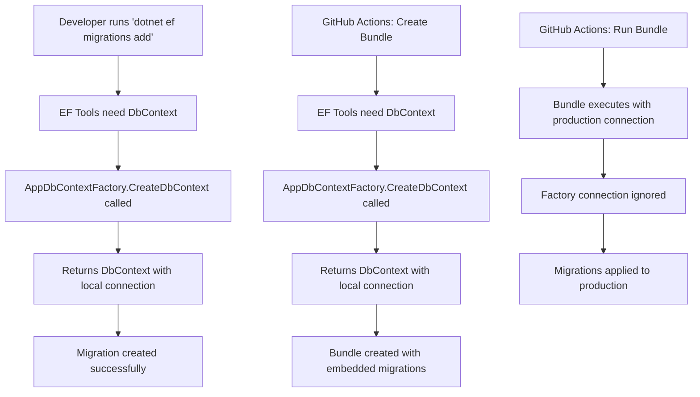

# AppDbContextFactory Documentation

## Overview

The `AppDbContextFactory` is a crucial component that implements `IDesignTimeDbContextFactory<T>` to provide Entity Framework Core with a way to create `DbContext` instances during design-time operations. This is essential for EF Core tooling operations like migrations, scaffolding, and bundle creation.

## What is IDesignTimeDbContextFactory?

`IDesignTimeDbContextFactory<T>` is an interface that tells Entity Framework Core how to create your `DbContext` when the EF tools need to perform operations outside of your running application. This includes:

- Creating migrations (`dotnet ef migrations add`)
- Updating database (`dotnet ef database update`)
- Creating migration bundles (`dotnet ef migrations bundle`)
- Scaffolding operations
- Other EF Core CLI operations

## Code Explanation

```csharp
using Microsoft.EntityFrameworkCore;
using Microsoft.EntityFrameworkCore.Design;

namespace TodoWebApi;

public class AppDbContextFactory : IDesignTimeDbContextFactory<AppDbContext>
{
    public AppDbContext CreateDbContext(string[] args)
    {
        var optionsBuilder = new DbContextOptionsBuilder<AppDbContext>();

        // Use a default connection string for design-time operations
        // This will be overridden by the --connection parameter when running the bundle
        var connectionString = "Host=localhost;Database=car-management;Username=postgres;Password=localpassword";

        optionsBuilder.UseNpgsql(connectionString);

        return new AppDbContext(optionsBuilder.Options);
    }
}
```

### Key Components:

1. **Interface Implementation**: Implements `IDesignTimeDbContextFactory<AppDbContext>`
2. **CreateDbContext Method**: The single method that EF Core calls to get a DbContext
3. **Hardcoded Connection String**: Uses a simple, local connection string for design-time operations
4. **DbContextOptionsBuilder**: Configures the DbContext options

## Why This Factory is Needed

### The Problem Without Factory

Your main application (`Program.cs`) has complex configuration logic:

```csharp
// Complex startup configuration in Program.cs
builder.Services.AddDbContext<AppDbContext>((sp, options) =>
{
    if (environment == "Development")
    {
        // Use local connection string
    }
    else
    {
        // Use AWS Secrets Manager to get connection string
        var credentialsService = sp.GetRequiredService<IDatabaseCredentialsService>();
        // ... complex async operations
    }
});
```

**Problems with this approach for EF tooling:**

- ❌ EF tools run outside your application context
- ❌ Dependency injection container isn't available
- ❌ AWS services aren't accessible during design-time
- ❌ Environment variables might not be set correctly
- ❌ Complex async operations can't be easily resolved

### The Solution With Factory

The factory provides a **simple, dependency-free** way to create DbContext for tooling operations.

## Impact on Different Scenarios

### 1. Local Development

#### **Without AppDbContextFactory:**

```bash
# This would FAIL
dotnet ef migrations add NewMigration
# Error: Cannot resolve dependencies, AWS services not available
```

#### **With AppDbContextFactory:**

```bash
# This WORKS
dotnet ef migrations add NewMigration
# Uses: Host=localhost;Database=car-management;Username=postgres;Password=localpassword
```

**Benefits for Local Development:**

- ✅ EF migrations work without complex setup
- ✅ No need to configure AWS credentials for tooling
- ✅ Matches your local Docker PostgreSQL setup
- ✅ Consistent with `appsettings.json` local connection string

### 2. GitHub Actions & CI/CD

#### **Migration Bundle Creation (Design-Time):**

In your GitHub Actions workflow:

```yaml
- name: Create EF Migrations bundle
  run: |
    dotnet tool install --global dotnet-ef
    dotnet ef migrations bundle --project TodoWebApi/TodoWebApi.csproj --output efbundle --self-contained
```

**What happens:**

1. EF tooling needs to create a DbContext to analyze your model
2. It calls `AppDbContextFactory.CreateDbContext()`
3. Factory returns DbContext with local connection string
4. EF creates bundle with all migration SQL embedded
5. **The bundle is created successfully** without needing AWS access

#### **Bundle Execution (Runtime):**

```yaml
- name: Run EF Migrations bundle
  run: ./efbundle --connection "${{ secrets.AWS_RDS_HOST_CONNECTIONSTRING }}"
```

**What happens:**

1. Bundle runs with production connection string from GitHub secrets
2. **Overrides** the factory's connection string with actual production connection
3. Applies migrations to production database

### 3. Production Deployment

#### **Bundle Runtime Behavior:**

When you run the bundle:

```bash
./efbundle --connection "Host=prod-server;Database=prod-db;Username=prod-user;Password=prod-pass"
```

**The flow:**

1. Bundle was created using factory's local connection string (design-time)
2. Bundle executes using provided production connection string (runtime)
3. **Factory's connection string is ignored during bundle execution**

## Relationship with appsettings.json

### Local Development Configuration

**appsettings.json:**

```json
{
  "ConnectionStrings": {
    "Local": "Host=localhost;Database=car-management;Username=postgres;Password=localpassword",
    "Production": "Host=demo-database.ca1uii040tyz.us-east-1.rds.amazonaws.com;Database=car-management;Username=awsuser;Password=awspassword"
  }
}
```

**AppDbContextFactory.cs:**

```csharp
var connectionString = "Host=localhost;Database=car-management;Username=postgres;Password=localpassword";
```

### Why They Match

The factory's hardcoded connection string **intentionally matches** the `"Local"` connection string in `appsettings.json` because:

1. **Consistency**: Both local development and EF tooling use the same database
2. **Simplicity**: No need to read configuration files in the factory
3. **Reliability**: EF tooling works regardless of configuration file issues

## Best Practices

### 1. Keep Factory Simple

```csharp
// ✅ GOOD - Simple, hardcoded
var connectionString = "Host=localhost;Database=car-management;Username=postgres;Password=localpassword";

// ❌ BAD - Complex configuration reading
var configuration = new ConfigurationBuilder()
    .AddJsonFile("appsettings.json")
    .Build();
var connectionString = configuration.GetConnectionString("Local");
```

### 2. Match Local Environment

Ensure the factory's connection string matches your local development setup:

- Same host (localhost)
- Same database name
- Same credentials
- Same port (if non-standard)

### 3. Document the Purpose

Always include comments explaining the factory's role:

```csharp
// Use a default connection string for design-time operations
// This will be overridden by the --connection parameter when running the bundle
```

## Common Issues and Solutions

### Issue 1: "Connection string 'Local' is not configured"

**Cause:** EF tooling trying to use your main application's configuration
**Solution:** Add `AppDbContextFactory` to provide design-time configuration

### Issue 2: AWS credentials not available during migrations

**Cause:** EF tooling running outside application context
**Solution:** Factory bypasses AWS dependency for design-time operations

### Issue 3: Different connection strings between factory and appsettings

**Cause:** Mismatch between factory and local configuration
**Solution:** Ensure both use identical connection parameters

## Migration Workflow Summary



## Conclusion

The `AppDbContextFactory` is a critical piece that enables Entity Framework Core tooling to work seamlessly across different environments:

- **Local Development**: Enables EF migrations and tooling
- **CI/CD Pipeline**: Allows bundle creation without AWS dependencies
- **Production Deployment**: Provides clean separation between design-time and runtime configurations

This pattern ensures that your complex production configuration doesn't interfere with development productivity while maintaining security and flexibility in production deployments.
